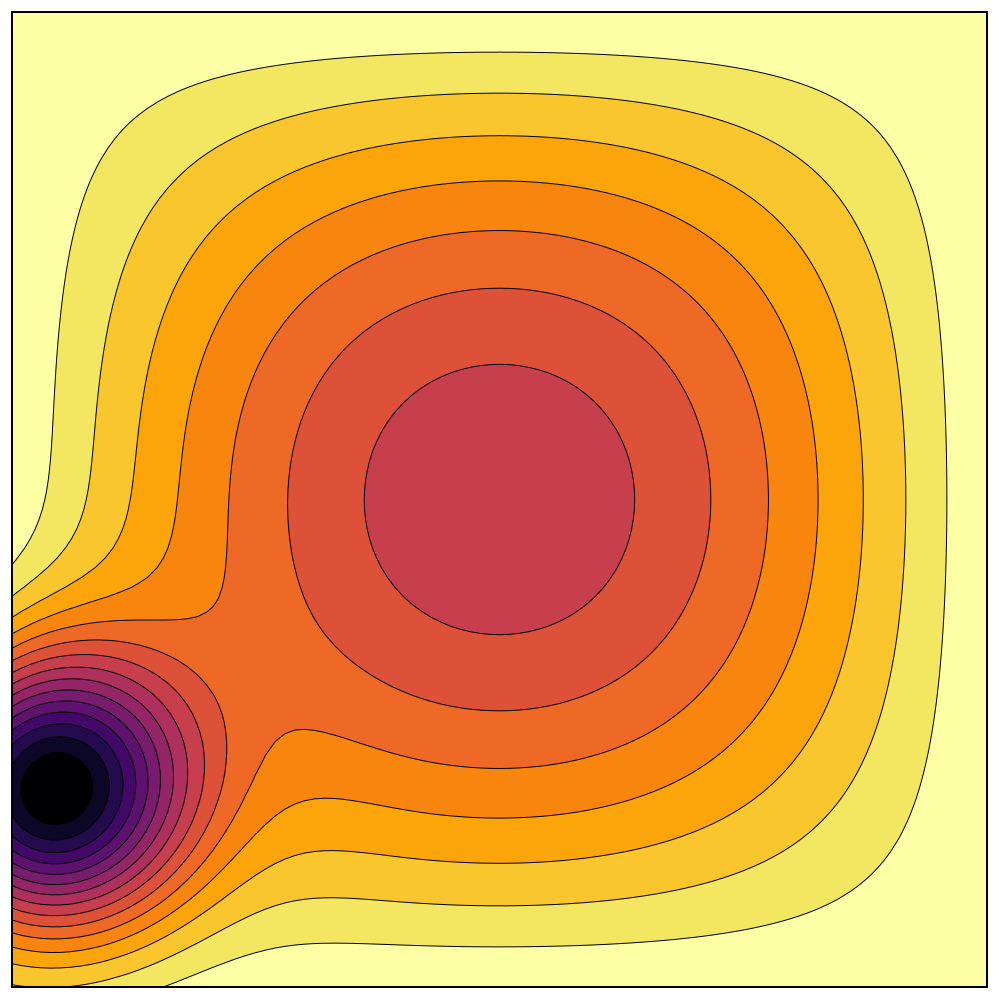

# Nested Sampling Primer

To start with, try and find the global minimum of the "secret" julia function. There are two minima in the unit hypercube. One is easy to finde, almost impossible to avoid finding. The other is harder. The "basin" for the second, deeper minima is about 10^19 times smaller than the other basin.

To import the julia function:  
```julia
julia> using Serialization

julia> g = deserialize("secret_function2.jls")
#1 (generic function with 1 method)

julia> g(rand(14))
-7.311984582327081e-6
```

The search space is a 14-dimensional hypercube. The function is well-defined outside of the hypercube (and there are other shallow minima elsewhere), but the deep minimum that you are looking for is inside the unit hypercube. 


As a warmup problem, you could try this 2D version. Make a nested sampling code that can find the deep minima for this case.


